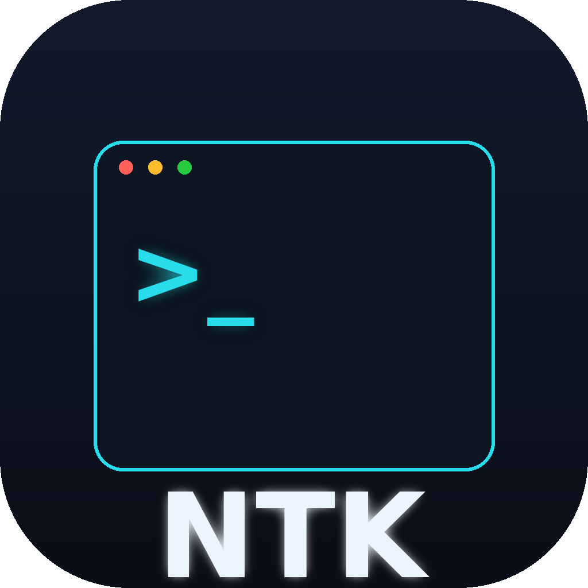

<div align="center">



# NTK — Next Tool Kit

**One CLI. 300+ terminal tools. Zero dependencies for the end user.**

Cross-platform developer toolkit for **Windows 10 / 11** and **Linux**.
Standalone executable — no Python, no Node.js, nothing to install.

`ntk-sys-info` · `ntk-net-ping` · `ntk-crypto-password 24` · `ntk-util-calc "2*(3+4)"`

> ⚠️ **BETA** — This is a beta release. Things may change and some tools depend on
> optional external CLIs (docker, aws, git, …). Feedback & issues welcome.

</div>

---

## ⚠️ Disclaimer — please read

NTK is **beta software provided "as is", without any warranty** (see [`LICENSE`](LICENSE)).

- **Errors can and will happen.** Some tools wrap external programs (docker, aws, ffmpeg, git, …)
  or need network access, elevated privileges, or a real terminal. If something is missing
  or unavailable, NTK prints a clear error and exits — it should **never** dump a raw crash,
  but bugs are still possible in a beta.
- **Use at your own risk.** Some tools modify files, processes, services, or system settings
  (e.g. `sys kill`, `file shred`, `sys shutdown`). Double-check arguments before running
  destructive commands. The author is **not liable** for any data loss or damage.
- **Not a security product.** The `sec`/`crypto` helpers are convenience utilities, not audited
  security tooling. Don't rely on them for anything critical.
- **Found a bug?** Please open an issue:
  [github.com/finnytech/ntk-Next-Tool-Kit-terminal-cli/issues](https://github.com/finnytech/ntk-Next-Tool-Kit-terminal-cli/issues)

Every command supports `-h` for usage help, e.g. `ntk sys kill -h`.

---

## What is NTK?

NTK bundles **300+ practical command-line tools** into a single, fast, self-contained
executable — the way `npm`/`npx` feel, but for everyday system, network, crypto, dev,
and DevOps tasks. Every tool is one command away.

Two equivalent call styles:

```bash
ntk sys info          # space form
ntk-sys-info          # hyphen form (great for muscle memory & scripts)
```

Optional parameters follow the command:

```bash
ntk crypto password 24
ntk-crypto-password 24
ntk net ping google.com
ntk util calc "2*(3+4)"
```

## Quick Start — install, use, update

A 60-second guide. Pick your platform, then just use `ntk`.

### 1. Install

**Windows 10 / 11** — download **`ntk-installer.exe`** from the [latest release](../../releases),
run it (approve the UAC/Admin prompt), then **open a NEW terminal**. Done.
The installer puts `ntk` on your system PATH (CMD **and** PowerShell) + Registry, and
drops **`ntk-updater.exe`** next to it so you can update later.

**Linux** — download the `ntk` binary, then:
```bash
chmod +x ntk && sudo mv ntk /usr/local/bin/
```

> 💡 On Windows, if `ntk` seems "not found" right after installing, your terminal was
> open **before** the install. Just open a **fresh** CMD/PowerShell window — the PATH is
> set system-wide, so `ntk` then works from any folder.

### 2. Use it

```bash
ntk                       # banner + all 15 categories
ntk --help                # help
ntk sys                   # list every tool in the 'sys' category
ntk sys info              # run a tool (space form)
ntk-sys-info              # exact same thing (hyphen form)
ntk-crypto-password 24    # tools take parameters right after the name
ntk net ping google.com
ntk <cat> <tool> -h       # per-tool help
```

### 3. Keep it up to date

Whenever a new release ships, just run the updater — it pulls the newest build from
GitHub and replaces your `ntk` in place (self-elevates on Windows if needed):

```bash
ntk-updater               # Windows: run it (or double-click ntk-updater.exe)
./ntk-updater             # Linux
ntk-updater --force       # re-download & reinstall even if versions match
```

The updater checks your installed version against the latest GitHub release, downloads
the right binary for your OS, swaps it in, and confirms the new version. That's it.

---

## 15 Categories

| Category | What it does | Examples |
|---|---|---|
| `sys`    | System & OS monitoring/control | `sys info`, `sys top`, `sys kill-port 8080` |
| `net`    | Network & HTTP tools | `net ping`, `net portscan`, `net myip` |
| `file`   | Filesystem & storage | `file dupes`, `file bigfiles`, `file tree` |
| `text`   | Text & data processing | `text upper`, `text slugify`, `text json-fmt` |
| `crypto` | Cryptography & hashing | `crypto sha256`, `crypto uuid`, `crypto password` |
| `dev`    | Developer workflow | `dev lorem`, `dev color #ff8800`, `dev semver` |
| `auto`   | Automation & helpers | `auto watch`, `auto retry`, `auto repeat` |
| `docker` | Docker & containers | `docker ps`, `docker clean`, `docker dockerfile-gen` |
| `db`     | Database tools | `db sqlite-query`, `db dump`, `db csv-import` |
| `web`    | Advanced web & API | `web headers`, `web bench`, `web ip-geo` |
| `media`  | Media & asset tools | `media resize`, `media exif`, `media qr` |
| `ai`     | AI & LLM integrations | `ai tokens`, `ai regex-gen`, `ai json-schema` |
| `sec`    | Security & audit | `sec entropy`, `sec hash-identify`, `sec ports` |
| `cloud`  | DevOps & cloud | `cloud aws-s3-ls`, `cloud kube-ctx`, `cloud tf-lint` |
| `util`   | Utilities & terminal games | `util calc`, `util unit`, `util quote` |

Run `ntk` or `ntk --help` for the banner, `ntk <category>` to list a category's tools,
and `ntk <category> <tool> -h` for per-tool help.

## Install

### Windows 10 / 11

1. Download **`ntk-installer.exe`** from the [latest release](../../releases).
2. Run it (it will request Administrator rights via UAC).
3. Open a **new** terminal (CMD or PowerShell) and run `ntk --help`.

The installer copies `ntk.exe` to `C:\Program Files\NTK`, adds it to the **system PATH**
(works in CMD **and** PowerShell), and registers it in the **Windows Registry**
(App Paths + an uninstall entry in *Apps & features*).

Prefer no installer? Just grab **`ntk.exe`** and put it anywhere on your PATH.

### Linux

```bash
# Download the 'ntk' binary from the latest release, then:
chmod +x ntk
sudo mv ntk /usr/local/bin/
ntk --help
```

No Python required — the runtime is bundled.

## Design

- **Standalone** — built with PyInstaller; the Python runtime is embedded.
- **Lazy-loading** — each category lives in its own module and is only imported when used, so startup stays fast.
- **stdlib-first** — most tools use only the standard library. Tools that wrap external
  programs (docker, aws, ffmpeg, …) degrade gracefully with a clear hint when the tool is missing.
- **Cross-platform** — Windows 10/11 is the primary target; Linux is fully supported.

See [`CONVENTIONS.md`](CONVENTIONS.md) for the internal contract each tool module follows.

## Build from source

Requires Python 3.10+ and PyInstaller.

```bash
pip install -r requirements.txt pyinstaller
pyinstaller --clean --noconfirm ntk.spec       # -> dist/ntk(.exe)
python make_logo.py                            # regenerate assets/ntk.ico
pyinstaller --clean --noconfirm installer/ntk_installer.spec   # Windows installer
```

## License

MIT — see [`LICENSE`](LICENSE).

---

<div align="center">
Made with ✨ by <a href="https://github.com/finnytech">finnytech</a>
</div>
